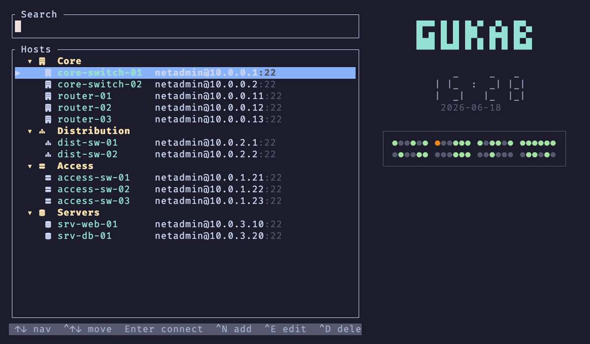

# gukab

A terminal-only (TUI) SSH connection manager for network devices. Built in Rust
with `ratatui` + `russh` (pure-Rust SSH, no OpenSSL). Targets Arch Linux x86_64
and macOS (Apple Silicon + Intel).



- **Fuzzy host search** — type a few characters in any order (`r3` finds
  `router-03`); the closest match floats to the top.
- **Host groups** — collapsible, per-group icons, indented members.
- **Session automation** — keyboard macros (`Ctrl+A` fuzzy picker) and
  regex `expect` rules that auto-answer prompts (e.g. enable passwords).
- **Credentials in the OS keychain** — never written to config files.
- **Session logging** — every session transcript saved per host.

## Install

### Linux / macOS — one-liner (recommended)

```sh
curl --proto '=https' --tlsv1.2 -LsSf \
  https://github.com/GokhanTurk/gukab/releases/latest/download/gukab-installer.sh | sh
```

This downloads the right prebuilt binary for your platform (x86_64 Linux, or
Apple Silicon / Intel Mac), installs it to `~/.local/bin` (or `~/.cargo/bin`),
and puts it on your `PATH`. No Rust toolchain required.

### Manual download

Grab the archive for your platform from the
[latest release](https://github.com/GokhanTurk/gukab/releases/latest), extract
it, and move the `gukab` binary somewhere on your `PATH`:

| Platform | Archive |
|----------|---------|
| Linux x86_64 (Arch) | `gukab-x86_64-unknown-linux-gnu.tar.xz` |
| Apple Silicon Mac | `gukab-aarch64-apple-darwin.tar.xz` |
| Intel Mac | `gukab-x86_64-apple-darwin.tar.xz` |

### From source

Requires a [Rust toolchain](https://rustup.rs):

```sh
git clone https://github.com/GokhanTurk/gukab
cd gukab
cargo install --path .
```

## Updating

If you installed via the one-liner, a self-updater is installed alongside:

```sh
gukab-update        # checks GitHub Releases and upgrades in place
```

Or just re-run the install one-liner — it always fetches the latest release.
From-source installs update with `git pull && cargo install --path .`.

## Usage

Run `gukab`. The host list opens with a search box on top.

| Key | Action |
|-----|--------|
| type | live fuzzy-filter the host list |
| `↑` / `↓` | move selection |
| `Enter` | connect to host / collapse-expand a group |
| `Ctrl+N` | new host form |
| `Ctrl+E` | edit selected host |
| `Ctrl+K` | add a standalone keyring credential |
| `q` / `Esc` | quit |

Inside a session, `Ctrl+A` opens the fuzzy **macro picker** (`Enter` runs,
`Esc` cancels, `Ctrl+D` disconnects, `Ctrl+A Ctrl+A` sends a literal `Ctrl+A`).

## Configuration

Config lives in `~/.config/gukab/`:

- `hosts.toml` — hosts and `[[groups]]` (icons, membership).
- `automations.toml` — reusable macros and their `expect` rules.
- `log/<host>/<timestamp>.log` — per-session transcripts.

Credentials (passwords) are stored in the OS keychain via the `keyring` crate,
never in `hosts.toml`.

Copy-paste starting points (fully commented):
[`examples/hosts.toml`](examples/hosts.toml) and
[`examples/automations.toml`](examples/automations.toml). The
[wiki](https://github.com/GokhanTurk/gukab/wiki) has the full reference.

## Security

- **Credentials** live only in the OS keychain (`keyring`); they are never written
  to `hosts.toml`, logs, or the terminal.
- **Host-key verification (TOFU):** on first connect a server's SSH host-key
  fingerprint is recorded in `~/.config/gukab/known_hosts`; later connections are
  refused if the key changes (possible MITM). To accept a legitimate key change,
  delete that host's line and reconnect.
- **File permissions:** `hosts.toml`, `known_hosts`, and session logs are written
  owner-only (`0600`), log directories `0700`. Session logs can contain sensitive
  command output (e.g. `show running-config`); review retention for your needs.
- **Known advisory:** [`RUSTSEC-2023-0071`](https://rustsec.org/advisories/RUSTSEC-2023-0071)
  (Marvin timing side-channel in the transitive `rsa` crate) has no upstream fix
  yet. Practical impact here is low — gukab is an SSH *client* and verifies RSA
  server signatures rather than performing RSA private-key decryption. It will be
  resolved when `rsa` ships a fix.

## License

[GPL-3.0-or-later](LICENSE).
